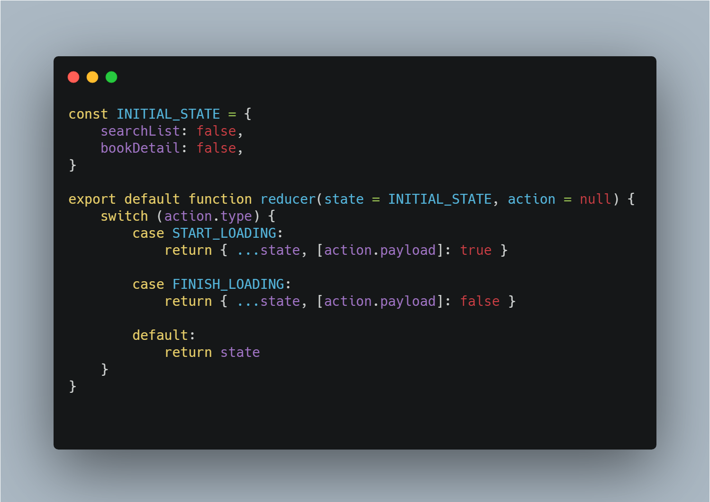
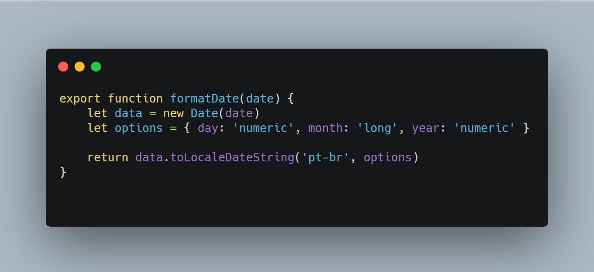

<h1>MyBookPlace</h1>

<image src=".github/images/responsive-showcase-mockup.jpg"/> 

 <a href="https://mybookplace.netlify.app/" target="_blank" rel="noopenner noreferrer"> Deploy na Netlify
 </a>

<image src="https://img.shields.io/github/license/Bluniz/My-Book-Place?style=for-the-badge"/>
<image src="https://img.shields.io/netlify/27a174b1-9fa9-4e3e-83d9-4abf8c248290?style=for-the-badge"/>

## Apresentação do projeto 🌟

<image src=".github/images/MyBookPlace.gif" />

---

## Sobre 📝

Este projeto foi construído durante o processo seletivo (Talent Sprint) da empresa Solutis em novembro de 2020. 

## Meus desafios 🔥
O principal desafio para mim foi utilizar o Redux como gerenciamento de estado, até então eu apenas sabia utilizar a ContextAPI. 
Gostaria de falar que achei muito organizado e muito melhor de se trabalhar em uma aplicação que escala em proporções maiores, as aulas do professor Irlan ajudaram bastante a entender todo o processo.

## Ideia inicial 💡
Fazer uma aplicação de pesquisas de livro que você possa ver os detalhes de um quando pesquisado e possa favoritar.
Pretendia utilizar 100% da API com autenticação do google ou um sistema independente com localStorage, infelizmente não pude aplicar os mesmo. Estas funcionalidades ficaram em pauta para futuras atualizações deste projeto.

## De onde veio o nome  do MyBookPlace?📚
A nome deste projeto vem da frase "Meu lugar dos livros" que em inglês fica "My place of Books" e resumidamente "MyBookPlace". 

## O que a aplicação faz?🎮
Basicamente ela pesquisa livros através da API Google Books, consiste em uma pesquisa normal com opções de filtro por "Mais novo" ou "Relevância", uma tela de visualização dos dados
e um botão "Comprar" que te guia até a página de compra no google books.

## Quantas rotas possui?🛣
Atualmente possui 3 rotas e um tratamento de rro, sendo elas:
<ul>
  <li> /home -> Tela Inicial com a logo da aplicação
  <li> /search -> Tela de pesquisa com a filtragem e paginação
  </li>
  <li> /book/:id do livro -> Detalhes de um livro especifico
  </li>
  <li> /* -> Caso o usuário digite alguma rota que não existe na aplicação, irá ir direto para uma pagina 404
  </li>
</ul>

## Redux - Quantas stores?
Atualmente possuimos 3 stores diferentes sendo elas:
<ul>
<li> Books -> Store destinada as pesquisas de livros
</li>
<li> Book -> Store destinada a um livro em especifico
</li>
<li> loading -> Store destinada a controlar TODOS os loadings da aplicação, podendo controlar loadings especificos de todas as paginas
</li>
</ul>

## Coisas que acho muito legal em minha aplicação
<ul>
<li> Store de Loading dinâmica, ela pode controlar os loadings tanto de páginas quanto componentes, sua aplicação pode crescer bastante futuramente então creio que essa é uma solução que sirva pra diversos casos.  
Resumidamente, utilizando recursos do ES6 eu posso fazer uma ação de iniciar e finalizar loading que receba apenas o nome da pagina ou componente que eu deseja modificar seu loading.

</li>
<li> Minha função de formatar datas utilizando o formatador nativo do Javascript. Basicamente
o new Date("alguma data aqui") retorna a uma data no formato definido pelo teu navegador ou html. Tu pode alterar o formato desta data, para ser dd/mm/yy e também alterar a localidade, assim ela irá traduzir para o que tu quer.  
Utilizando o .toLocaleDateString tu converte sua string para a localidade que tu quer(neste caso "pt-br") e pode passar como parametro o formato que tu quer que seja a resposta, neste caso eu defini o dia como um Numerico(retorno de numero), o mês como um long ou seja retornar o nome do mês e o ano numerico para retornar seu ano numero. Um exemplo de retorno seria: "10 de setembro de 2020"

</li>
</ul>

## Tecnologias 🚀

- <a href="https://pt-br.reactjs.org/">ReactJs</a>
- <a href="https://material-ui.com/pt/">Material Ui</a>
- <a href="https://github.com/axios/axios">Axios</a>
- <a href="https://redux.js.org/">Redux</a>
- <a href="https://eslint.org/">Eslint</a>
- <a href="https://prettier.io/">Prettier</a>

## Ô Lucas, seu readme não está mt grande não?
Sim cara, está grande mesmo. Porém para além do processo seletivo do qual estou participando eu estou utilizando esta aplicação como estudo. Portanto pretendo falar detalhes, coisas que eu acho legal e tudo mais.
## Como contribuir 🤔

- Fork este repositório;
- Cria uma branch com sua feature(Funcionalidade): `git checkout -b my-feature`;
- Commite suas mudanças: `git commit -m 'feat: my new feature'`;
- Realize um Push para sua branch: `git push origin my-feature`.

## License 📃

> This project is under the MIT license. See the archive [LICENSE](LICENSE) for more details.

---

##### Made by Lucas Rosa(@Bluniz) 🌊